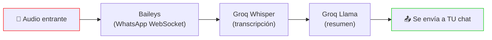
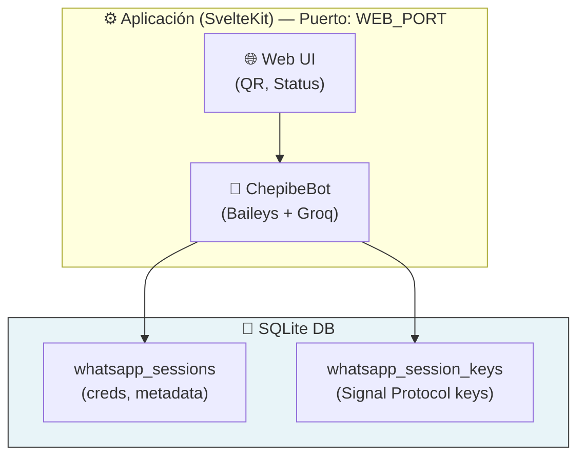

# ChePibe - Personal

Transcripción privada de audios de WhatsApp con IA. Self-hosted, cero logs, código abierto.

[Che Pibe](https://personal.chepibe.ai)

[](./LICENSE)
[](./docker-compose.yml)

## Privacidad

Este sistema **no guarda ningún log** de contenido de audio ni transcripciones. El audio se procesa en memoria y se descarta inmediatamente. Sin transcripciones, sin grabaciones, sin rastros.

## Qué Hace

Enviá o recibí una nota de voz en WhatsApp → recibís la transcripción y un resumen en tu propio chat. Potenciado por Groq Whisper (transcripción) y Llama (resumen). En menos de 5 segundos.

## 🚀 Inicio Rápido (1 Comando)

### Requisitos

- [Docker](https://docs.docker.com/get-docker/)
- Una [API key de Groq](https://console.groq.com/) (tier gratuito disponible)

### Configuración

```bash
# 1. Clonar
git clone https://github.com/fibra-labs/chepibe-personal.git
cd chepibe-personal

# 2. Instalar
pnpm install

# 3. Configurar
cp .env.example .env
```

Editá `.env` — solo dos valores son necesarios:

```bash
# Tu número de WhatsApp: código de país + número, SIN el signo +
# Ejemplo Argentina: 5491171234567
ALLOWED_PHONE=5491171234567

# Obtenela en https://console.groq.com/
GROQ_API_KEY=gsk_xxxxxxxx
```

### Iniciar

```bash
pnpm start
```

Abrí `http://localhost:3000` (o tu `WEB_PORT` custom), escaneá el código QR con WhatsApp, y listo. Cada nota de voz que envíes o recibas se transcribirá y resumirá en tu propio chat.

### Detener

```bash
pnpm stop
```

### Ver Logs

```bash
pnpm logs
```

## Cómo Funciona



- **Tus propios audios** → transcritos y enviados de vuelta a vos
- **Audios de otros** (grupos, DMs) → transcritos con info del remitente, enviados a vos
- El audio se procesa **en memoria** y **nunca se guarda**

## Instalación Manual (Sin Docker)

### Requisitos

- [Node.js](https://nodejs.org/) >= 25
- [pnpm](https://pnpm.io/) >= 9
- [API key de Groq](https://console.groq.com/)

### Instalar y Ejecutar

```bash
git clone https://github.com/fibra-labs/chepibe-personal.git
cd chepibe-personal

pnpm install
cp .env.example .env
# Editar .env con ALLOWED_PHONE y GROQ_API_KEY

# Iniciar modo desarrollo
# Nota: Hay que pasar ALLOWED_PHONE explícitamente ya que SvelteKit solo carga .env desde packages/web/
ALLOWED_PHONE=$(grep ALLOWED_PHONE .env | cut -d '=' -f2) pnpm dev:web
```

Abrí `http://localhost:5173` para escanear el código QR.

**Nota sobre Variables de Entorno:** SvelteKit requiere `ALLOWED_PHONE` disponible en runtime para mostrar tu cuenta configurada. En Docker se maneja automáticamente. Para desarrollo local, tenés que:
1. Pasarlo explícitamente: `ALLOWED_PHONE=61497369759 pnpm dev:web`
2. Copiar `.env` a `packages/web/.env` (SvelteKit carga env desde la raíz del paquete)

## Variables de Entorno

| Variable | Requerida | Descripción | Default |
|----------|-----------|-------------|---------|
| `ALLOWED_PHONE` | **Sí** | Tu número de WhatsApp (código de país + número, sin el +) | — |
| `GROQ_API_KEY` | **Sí** | API key de Groq | — |
| `GROQ_WHISPER_MODEL` | No | Modelo de Whisper para transcripción | `whisper-large-v3` |
| `GROQ_LLM_MODEL` | No | Modelo LLM para resumen | `llama-3.1-8b-instant` |
| `DATABASE_URL` | No | URL de la base de datos (local o Turso) | `file:./data/chepibe-personal.db` |
| `DATABASE_PASSWORD` | No | Password de la base de datos (solo Turso remoto) | — |
| `WEB_PORT` | No | Puerto web expuesto al host (Docker) | `3000` |
| `DEBUG` | No | Activar logs detallados de Baileys | `false` |

**Nota:** Para `pnpm dev:web`, `ALLOWED_PHONE` debe pasarse explícitamente (ver sección Instalación Manual) ya que SvelteKit solo auto-carga `.env` desde el directorio del paquete, no desde la raíz del monorepo.

### Formato de ALLOWED_PHONE

El `ALLOWED_PHONE` es tu número de WhatsApp en formato internacional **sin el signo +**:

| País | Formato | Ejemplo |
|------|---------|---------|
| Argentina | 54 + área + número | `5491171234567` |

## Arquitectura



Sin Redis. Sin servicios externos además de Groq y WhatsApp.

**ChepibeBot** es una librería embebida dentro del proceso SvelteKit. No hay servidor HTTP separado. La UI accede al estado del bot directamente via la API de la librería.

## Estructura del Proyecto

```
chepibe-personal/
├── packages/
│   ├── shared/              # Esquema DB, tipos, migraciones
│   ├── whatsapp-worker/     # Librería ChepibeBot (Baileys + Groq)
│   └── web/                 # Frontend SvelteKit 5 (en Español) + servidor
├── docs/                    # Arquitectura, Baileys, Seguridad
├── docker-compose.yml       # Producción (1 comando para iniciar)
├── .env.example             # Variables de entorno requeridas
└── package.json             # Workspace de pnpm
```

## Base de Datos

El sistema usa dos tablas SQLite:

- **`whatsapp_sessions`** — Metadata de sesión y credenciales de Baileys (para reconexión)
- **`whatsapp_session_keys`** — Keys del Signal Protocol (una fila por key, para descifrado de mensajes)

Ninguna tabla almacena contenido de audio, transcripciones o resúmenes. Ver [docs/seguridad.md](docs/seguridad.md) para detalles.

## Desarrollo

```bash
pnpm install

# Modo dev
pnpm dev:web

# Build completo
pnpm build

# Base de datos
pnpm db:generate     # Generar migraciones
pnpm db:migrate     # Ejecutar migraciones
pnpm db:studio      # Drizzle Studio
```

## Licencia

GNU Affero General Public License v3 — ver [LICENSE](./LICENSE).

Este proyecto está licenciado bajo AGPLv3, una licencia copyleft fuerte que garantiza tu libertad de usar, estudiar, modificar y compartir este software — con la condición de que si ejecutás una versión modificada en una red, debés poner el código fuente de tus modificaciones a disposición de tus usuarios bajo los mismos términos. AGPL asegura transparencia del código fuente para todas las modificaciones que se exponen en red.

**Uso comercial** — Si querés usar este software comercialmente sin los requisitos de compartición de código fuente de AGPL, hay una licencia comercial separada disponible. Contactá a [fibra@fibra.dev](mailto:fibra@fibra.dev).

## Contribuir

Pull requests bienvenidos. Para cambios mayores, abrí un issue primero.
