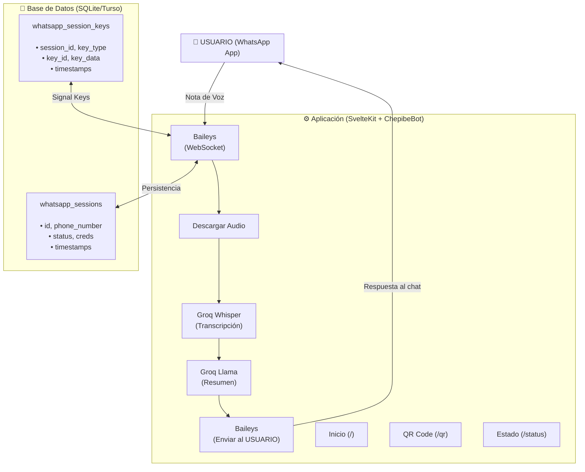
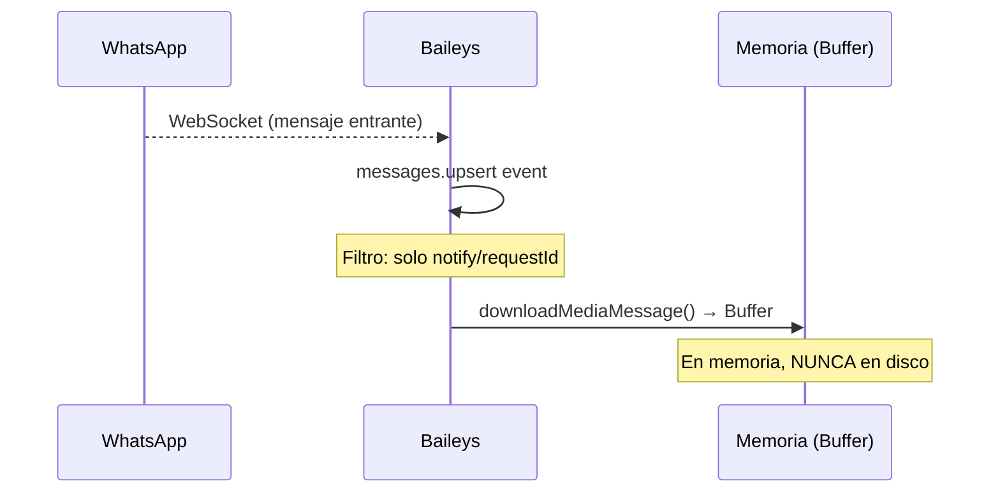
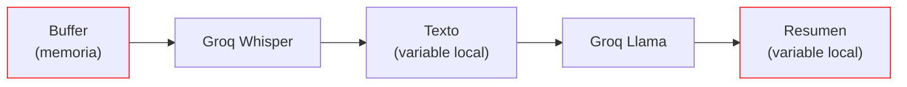
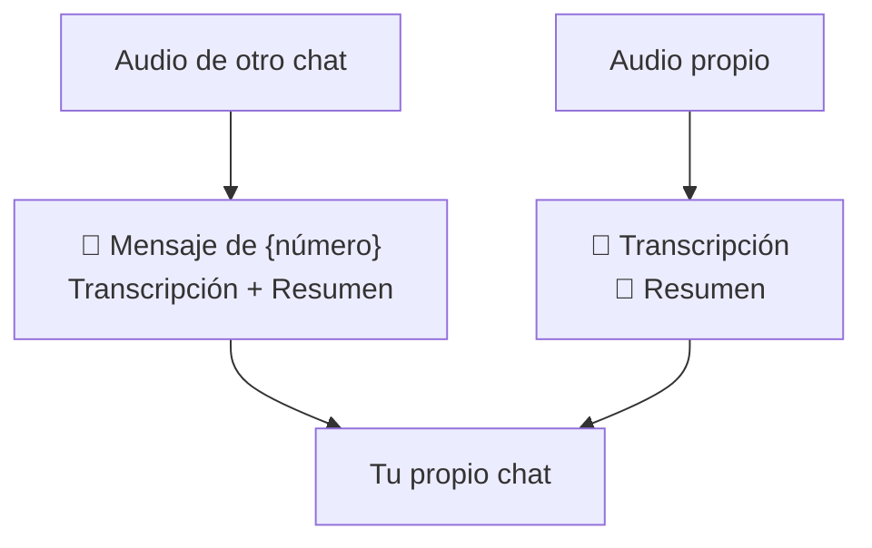
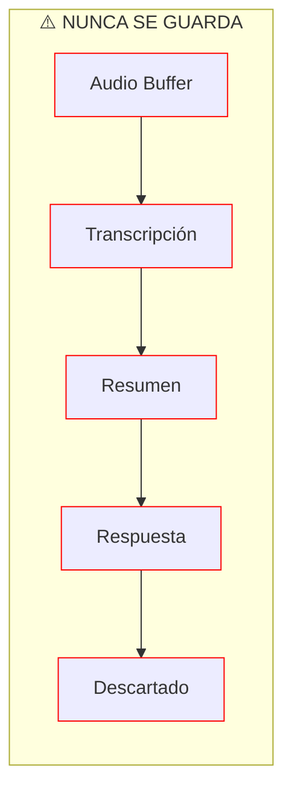
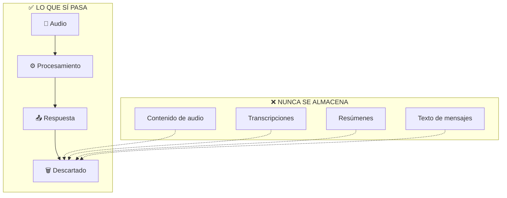

# Arquitectura

## Diagrama de Componentes



> **Nota de Privacidad**: Los diagramas muestran solo metadata de sesión (creds, keys). **Ningún contenido de mensaje, transcripción o audio se almacena en la DB ni en logs.**

## Flujo de Datos

> **⚠️ PRIVACIDAD ABSOLUTA**: En ningún punto del flujo se almacena o loguea contenido de mensajes, transcripciones, resúmenes o audio. Todo procesamiento es en memoria.

### 1. Recepción de Audio



**Filtros aplicados:**
- Solo `notify` (mensajes nuevos) o `requestId` (offline). Excepción: mensajes `append` que contienen audio también se procesan
- Solo `audioMessage` o `pttMessage`
- Mensajes propios (`fromMe`) con audio también se procesan
- **Deduplicación**: Cache 24h con key `${phoneNumber}:${msgId}`
- **Número remitente**: Se extrae del `participant` (grupos) o `sender` (DMs). Para LIDs (`@lid`), el ID crudo se usa como identificador en el mensaje de respuesta

> **Nota**: Los filtros solo usan IDs de mensaje para deduplicación. **Ningún contenido de mensaje se almacena.**

### 2. Procesamiento



| Paso | Servicio | Modelo | Latencia |
|------|----------|--------|----------|
| Descarga | In-memory Buffer | - | < 1s |
| Transcripción | Groq Whisper | `whisper-large-v3` | ~2-3s |
| Resumen | Groq Llama | `llama-3.1-8b-instant` | ~1-2s |
| Respuesta | Baileys | - | < 1s |

**Tiempo total típico**: 5-7 segundos

### 3. Respuesta al Usuario Conectado

**SIEMPRE se envía al usuario conectado, nunca al remitente del audio.**





**Zero-Log**: Audio, transcripción y resumen existen solo como variables locales. Se envían directamente al chat del usuario y se descartan. **No se almacenan en DB ni se incluyen en logs.**

### Formato de Respuesta

**Audio propio:**
```
🎤 *Transcripción:*
[texto transcrito]

📝 *Resumen:*
[resumen generado]
```

**Audio de otro (grupo o DM):**
```
📱 Mensaje de 5491112345678:

🎤 *Transcripción:*
[texto transcrito]

📝 *Resumen:*
[resumen generado]
```

## Base de Datos

### Tabla: whatsapp_sessions

Almacena metadata de sesión y credenciales de Baileys.

```sql
CREATE TABLE whatsapp_sessions (
  id TEXT PRIMARY KEY,
  phone_number TEXT,
  status TEXT DEFAULT 'pending',
  creds TEXT,           -- JSON con BufferJSON.replacer
  created_at INTEGER,
  updated_at INTEGER
);
```

**Nota sobre `creds`**: Este campo contiene el estado de autenticación de Baileys, incluyendo:
- Signal Protocol credentials (identity keys, signed pre-keys, etc.)
- **`processedHistoryMessages`**: array de keys de mensajes sincronizados (solo IDs y metadata, **NO contenido**)
- Account settings y device info

El sistema **no controla** qué guarda Baileys en `creds` — es opaco para nosotros.

### Tabla: whatsapp_session_keys

Almacena las Signal Protocol keys por separado (una fila por key). Esto permite escalabilidad y queries eficientes.

```sql
CREATE TABLE whatsapp_session_keys (
  id INTEGER PRIMARY KEY AUTOINCREMENT,
  session_id TEXT NOT NULL,
  key_type TEXT NOT NULL,         -- app-state-sync-key, sender-key-memory, etc.
  key_id TEXT NOT NULL,
  key_data TEXT,                  -- JSON con BufferJSON.replacer
  created_at INTEGER,
  updated_at INTEGER,
  UNIQUE(session_id, key_type, key_id)
);
```

**Tipos de keys que Baileys almacena**:
- `app-state-sync-key` — Sincronización de estado de la app
- `sender-key-memory` — Claves de grupo (sender keys)
- `sender-key-state` — Estado de claves de grupo
- `lid-mapping` — Mapeo LID ↔ número de teléfono (Baileys v7)
- `device-list` — Lista de dispositivos (Baileys v7)
- `tctoken` — Tokens de confianza (Baileys v7)
- `pre-key`, `session` — Signal Protocol pre-keys y sesiones

### Datos NO Almacenados

- ❌ Contenido de audios
- ❌ Transcripciones
- ❌ Resúmenes
- ❌ Historial de conversaciones (texto de mensajes)
- ❌ **Contenido** de metadata de mensajes (el texto no se guarda)

**Lo que SÍ persiste en `processedHistoryMessages`** (dentro de `creds`, no controllable):
- Message IDs (referencias, no contenido)
- Timestamps
- JIDs (chat y participante)
- Flag `fromMe`

Esto es guardado automáticamente por Baileys y no contiene texto ni contenido de los mensajes.

## ChepibeBot — Librería Embebida

El `whatsapp-worker` ya no es un proceso separado. Es una librería (`ChepibeBot`) que se ejecuta dentro del proceso SvelteKit.

### API Pública

```typescript
import { ChepibeBot } from '@chepibe-personal/whatsapp-worker';

const bot = new ChepibeBot({
  groqApiKey: env.GROQ_API_KEY,
  allowedPhone: env.ALLOWED_PHONE,
  databaseUrl: env.DATABASE_URL,
  // ... opciones adicionales
});

await bot.start();

bot.getStatus();      // Estado de conexión
bot.getQR();           // Generar QR (o devolver alreadyConnected)
bot.disconnect(id);  // Desconectar sesión
await bot.destroy();  // Graceful shutdown
```

### Eventos

```typescript
bot.on('QR_READY', ({ sessionId, qrCode }) => { ... });
bot.on('CONNECTED', ({ sessionId, phoneNumber }) => { ... });
bot.on('DISCONNECTED', ({ sessionId, reason }) => { ... });
```

La UI del web accede al estado del bot directamente desde los `+page.server.ts` de SvelteKit, sin HTTP intermedios.

## Persistencia de Sesiones

Las sesiones sobreviven restarts de la app:

1. **Creds** se almacenan en `whatsapp_sessions.creds` (serializados con `BufferJSON.replacer`)
2. **Signal keys** se almacenan en `whatsapp_session_keys` (una fila por key, serializadas con `BufferJSON.replacer`)
3. **Al iniciar**, `ChepibeBot.start()` carga sesiones de la DB, crea un `SqliteKeyStore` por sesión, llama `loadFromDB()` para cargar keys del cache, y reconecta automáticamente
4. **Heartbeat** cada 30s verifica que las sesiones estén activas y reconecta las que se cayeron

## Seguridad en la Arquitectura

### 1. Zero-Log Design



### 2. Credenciales

- **Groq API Key**: Variable de entorno, nunca expuesta
- **Baileys Creds**: Almacenadas en SQLite (serializadas con BufferJSON)
- **Signal Keys**: Tabla separada, serializadas con BufferJSON

### 3. Red

Baileys usa WebSocket saliente, no requiere puertos abiertos al público.

## Recursos del Sistema

### Requisitos Mínimos

| Componente | CPU | Memoria | Disco |
|------------|-----|---------|-------|
| App (Web + Bot) | 0.3 core | 384 MB | 100 MB |

## Monitoreo

### Logs

Todos los logs usan Pino (structured logging). Con `DEBUG=true` se ven logs detallados de Baileys.

**Los logs NUNCA incluyen:**
- ❌ Contenido de mensajes
- ❌ Texto de transcripciones
- ❌ Resúmenes
- ❌ Contenido de audio

**Lo que SÍ incluyen:**
- ✅ IDs de sesión, números de teléfono (para debugging)
- ✅ Timestamps, duración de audio, mimetypes
- ✅ Estado de conexión (connected, disconnected, etc.)

Ejemplo de log con `DEBUG=true`:
```
Message received → audio → processing | phoneNumber: "54911..." | duration: 12.5 | mimetype: "audio/ogg"
```
**Nunca**: contenido del audio, transcripción, o texto del mensaje.

### Heartbeat

Cada 30 segundos, el bot loguea las sesiones activas:
```
Heartbeat: 1 session(s) active
  sessionId: "session_abc" status: "connected" phoneNumber: "54911..."
```

### Health Checks

- Web: `GET /api/health`
- Estado del bot: `GET /api/status`
