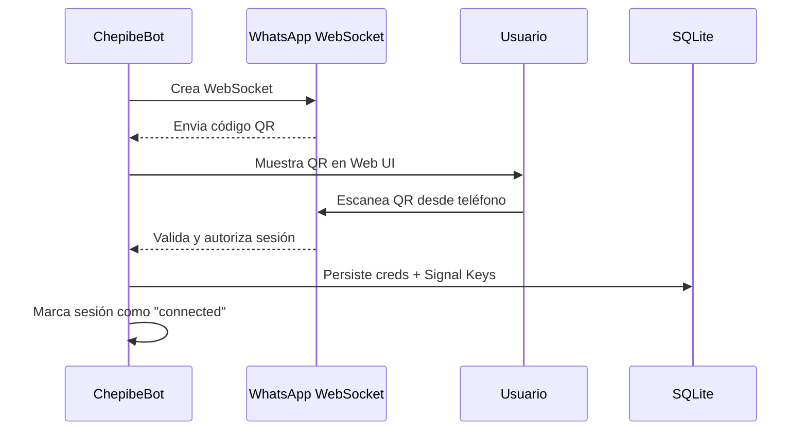
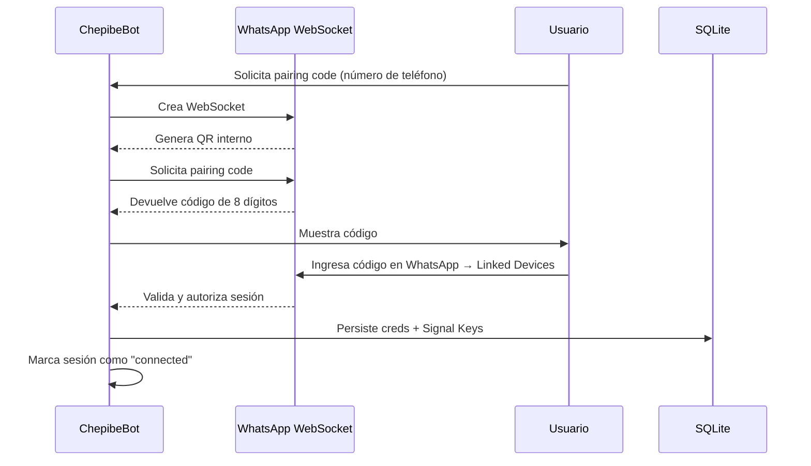
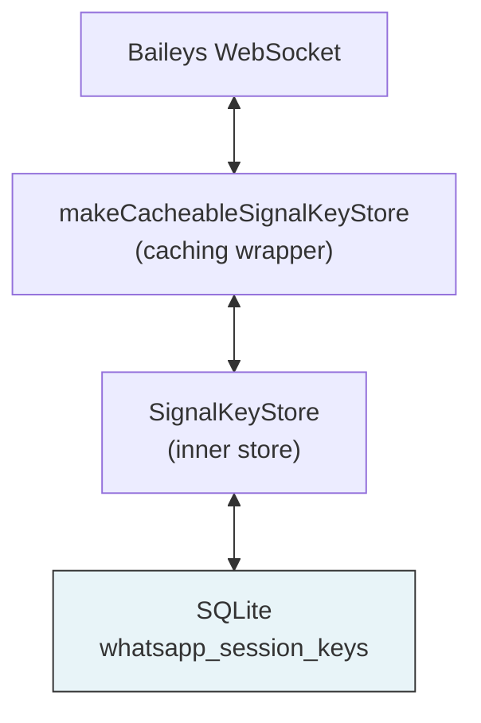

# Baileys - Sincronización con WhatsApp

## ¿Qué es Baileys?

[Baileys](https://github.com/WhiskeySockets/Baileys) v7 es una librería Node.js (ESM-only) que implementa el protocolo de WhatsApp Web. Permite:

- Conectarse a WhatsApp **sin** usar la API oficial de WhatsApp Business
- Recibir y enviar mensajes
- Descargar media (fotos, videos, audios)
- Gestionar sesiones múltiples
- Sistema LID (Local Identifier) para anonimato en grupos

## Autenticación

### Flujo de Conexión QR



El QR tiene un timeout de 60 segundos en el backend. Si el usuario escanea después del timeout, el QR ya no será válido y se generará uno nuevo.

### Flujo de Conexión con Código de Emparejamiento (Pairing Code)

Alternativa al QR: el usuario ingresa su número de teléfono y recibe un código de 8 dígitos para ingresar en WhatsApp.



**Diferencias clave vs QR:**
- No requiere escanear — el usuario ingresa el código manualmente en WhatsApp
- Útil cuando la cámara no funciona o el QR no carga
- El código tiene timeout de 60 segundos
- Requiere número de teléfono como parámetro
- API: `bot.requestPairingCode(phoneNumber)`

**Formato del número de teléfono:** Debe ser el número completo en formato internacional **sin el signo `+`** (ej. `5491171234567` para Argentina, `14155552671` para EE.UU.). Este valor se configura en la variable de entorno `ALLOWED_PHONE`.

**Límite de dispositivos:** WhatsApp permite hasta 5 dispositivos vinculados por cuenta. Che Pibe Personal usa una sola sesión activa. Si la sesión se destruye con `deleteData: true`, el dispositivo se desvincula y se libera un slot.

### Reconexión Automática

Las credenciales se almacenan en SQLite y permiten reconectar sin escanear QR:


**Estrategia de reintento**:
- Delay exponencial: 2s, 4s, 8s, 16s... hasta 60s máximo
- Máximo 10 intentos antes de considerar fallo
- Error 401 (logged out) → borrar credenciales, requiere nuevo QR
- Error 515 (restart required) → reconectar inmediatamente con creds guardadas

## Signal Protocol Key Store

### Arquitectura

Baileys usa el Signal Protocol para encriptación E2E. Las keys se almacenan en SQLite como filas individuales:



### Tabla whatsapp_session_keys

Cada Signal key es una fila separada:

```
session_id | key_type              | key_id        | key_data
-----------|----------------------|---------------|-------------------
session_1  | app-state-sync-key   | key_123       | {"type":"Buffer",...}
session_1  | sender-key-memory    | 54911@g.us    | {...}
session_1  | lid-mapping          | 27713@lid     | {...}
session_1  | pre-key              | 971           | {...}
```

**Unique constraint**: `(session_id, key_type, key_id)` — permite upserts eficientes.

### Serialización

- **Guardar**: `JSON.stringify(value, BufferJSON.replacer)` — Buffers se codifican como `{type: "Buffer", data: "base64..."}`
- **Cargar**: `JSON.parse(data, BufferJSON.reviver)` — Convierte de vuelta a Buffers

**No usar `deepReviveBuffers`** — causa doble-revival y corrompe las keys.

### Batch Flush

- Mutations (upsert/delete) se encolan en memoria
- Cada 2 segundos se flushan a SQLite
- Si la cola supera 1000 items, se fuerza flush inmediato
- Flushes fallidos se re-encolan para retry
- Al desconectar sesión se fuerza flush final

## LID System (Baileys v7)

WhatsApp migró a LID (Local Identifier) para anonimato en grupos:

- **PN** (Phone Number): Formato viejo `54911...@s.whatsapp.net`
- **LID**: Nuevo formato `27713...@lid` — único por usuario, no por grupo
- Los mensajes nuevos usan LID por defecto
- `remoteJidAlt` / `participantAlt` contienen el PN alternativo
- El key store guarda keys `lid-mapping` para resolver LID ↔ PN

### Manejo en Che Pibe Personal

Cuando llega un audio de un LID (`@lid`), extraemos el número de teléfono del `participantAlt` o usamos el `phoneNumber` de la sesión del usuario conectado.

## Manejo de Mensajes

### Filtros

```typescript
// 1. Solo notify o requestId (offline). Excepción: mensajes append que contienen audio.
if (m.type !== 'notify' && !m.requestId) {
    const hasAudio = m.messages?.some(msg =>
        msg.message?.audioMessage || msg.message?.pttMessage
    );
    if (!hasAudio) return;
}

// 2. De nosotros sin audio = skip (es respuesta del bot)
if (isFromMe && !audioMessage) return;

// 3. Deduplicación: cache 24h con key "${sessionId}:${msgId}"
if (processedMessages.has(dedupKey)) return;

// 4. Solo audioMessage o pttMessage se procesan
const audioMessage = message.message.audioMessage || message.message.pttMessage;
if (!audioMessage) return;
```

### Logs

Cada mensaje genera un log claro:

```
Message received → audio → processing     (con phoneNumber, duration, mimetype)
Message received → not audio → skipping   (con msgType: conversation, imageMessage, etc.)
Message received → duplicate → skipping
Message received → from self → not audio → skipping (likely bot reply)
Message received → not notify/offline → skipping  (status messages, typing, etc.)
```

### Respuesta

**Siempre se envía al usuario conectado** (su propio chat), nunca al remitente:

- Audio propio → Respuesta directa al chat del usuario
- Audio de otro → Respuesta al chat del usuario con "📱 Mensaje de {número}:"

## Códigos de Desconexión

| Code | Nombre | Acción | Borrar Creds? |
|------|--------|--------|---------------|
| 401 | LOGGED_OUT | Requiere nuevo QR | SÍ |
| 405 | METHOD_NOT_ALLOWED | Esperar y reintentar | NO |
| 440 | CONFLICT | Esperar y reintentar | NO |
| 515 | RESTART_REQUIRED | Reconectar inmediatamente | NO |

## Errores Conocidos

### `init queries` 500

WhatsApp server devuelve 500 en el handshake inicial. No es fatal — la conexión permanece abierta. Baileys maneja esto internamente.

### `failed to decrypt message` en grupos

Puede ocurrir si las Signal keys están corruptas o desactualizadas. Solución: borrar sesión y re-escanear QR.

### `PreKey error detected, uploading and retrying`

Baileys detecta PreKeys inválidas y las re-genera automáticamente. No requiere acción.

### `ERR_INVALID_ARG_TYPE` en transacciones

Causado por serialización incorrecta de Buffers. Solución: usar `BufferJSON.replacer`/`BufferJSON.reviver` consistentemente.

## Solución de Problemas

### QR no genera

- Verificar conexión a internet
- Revisar logs con `DEBUG=true`
- Reiniciar worker

### Desconexiones frecuentes

- Verificar estabilidad de red
- Revisar si hay 401 (sesión expirada)
- Chequear que las keys se están persistiendo (tabla `whatsapp_session_keys`)

### Mensajes no llegan

- Verificar que la sesión esté `connected` en el heartbeat
- Si hay `init queries` error, puede que la conexión esté degradada — reiniciar worker
- Verificar que `messages.upsert` se está disparando (activar `DEBUG=true`)

### Sesión no sobrevive restart

- Verificar que `whatsapp_session_keys` tenga datos (`SELECT COUNT(*) FROM whatsapp_session_keys`)
- Verificar que creds se guardaron en `whatsapp_sessions`
- Si la DB se borró, requiere re-escanear QR

## Patches (Solución a Bugs Conocidos)

Baileys v7.0.0-rc10, la versión actual de esta librería, aún contiene algunos errores conocidos. Para solucionarlos, `packages/whatsapp-worker/patch-baileys.sh` aplica automáticamente los siguientes cambios sobre la librería en `node_modules` después de ejecutar `pnpm install`.

### Parche 1: Eliminar `lidDbMigrated` del payload
**Archivo:** `lib/Utils/validate-connection.js`
**Problema:** La propiedad booleana `lidDbMigrated` es agregada por Baileys, pero no es reconocida correctamente por el servidor y puede causar rechazo de autenticación o sincronización.
**Solución:** Se elimina la línea que asigna `false` a dicha propiedad.

### Parche 2: Eliminar `await` en `noise.finishInit()`
**Archivo:** `lib/Socket/socket.js`
**Problema:** La función `noise.finishInit()` es síncrona, pero el código la envuelve en `await`. Esto genera una condición de carrera (race condition) que interrumpe el handshake y resulta en desconexiones inmediatas o ciclos de reconexión erráticos.
**Solución:** Se reemplaza `await noise.finishInit();` por `noise.finishInit();`.

### Parche 3: Cambiar `Platform.WEB` por `Platform.MACOS`
**Archivo:** `lib/Utils/validate-connection.js`
**Problema:** WhatsApp despreció (deprecated) la identificación `WEB` en favor de `MACOS` o `IOS` para la mayoría de sus flujos de autenticación modernos. Enviar `WEB` puede activar comprobaciones de seguridad y provocar desconexiones espontáneas.
**Solución:** Se reemplaza cualquier referencia a `Platform.WEB` por `Platform.MACOS`.

### Integración en Docker
El script se ejecuta automáticamente en el `Dockerfile` del web:
```dockerfile
RUN chmod +x ./packages/whatsapp-worker/patch-baileys.sh && \
    ./packages/whatsapp-worker/patch-baileys.sh
```

## Recursos

- [Baileys GitHub](https://github.com/WhiskeySockets/Baileys)
- [Baileys v7 Migration Guide](https://baileys.wiki/docs/migration/to-v7.0.0/)
- [Baileys API Reference](https://baileys.wiki/docs/api/classes/BinaryInfo)
