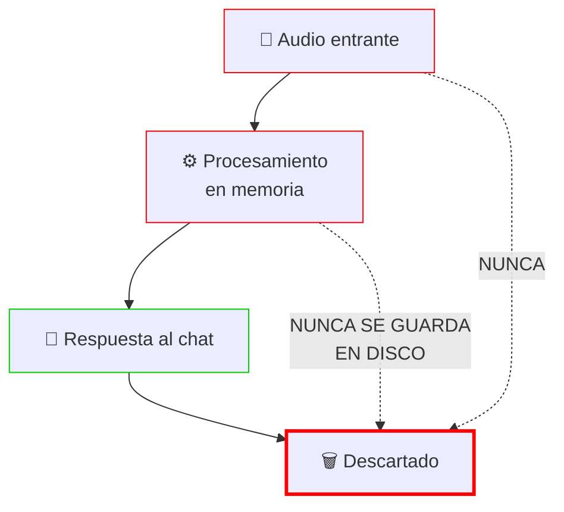
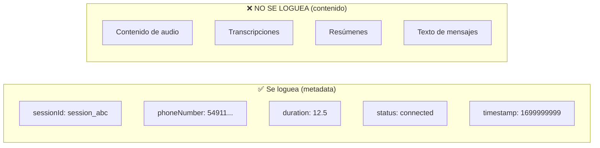
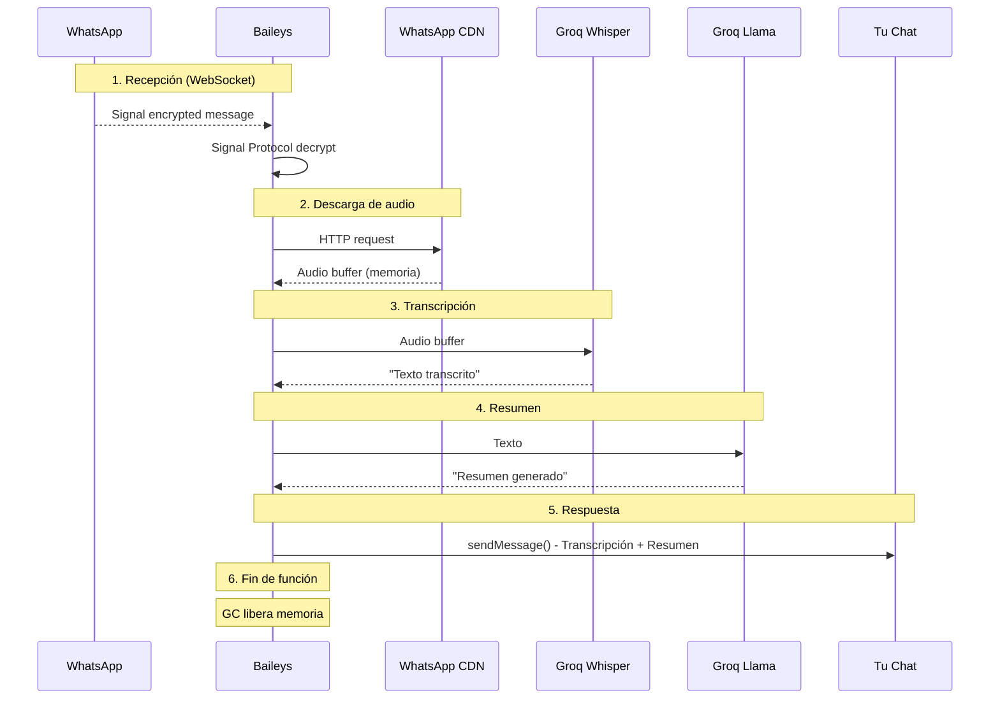

# Seguridad y Privacidad

## Principio Fundamental: Zero-Log

**Che Pibe Personal no almacena NADA del contenido del usuario.**



**Lo que NUNCA sucede:**
- ❌ Almacenar audio en disco
- ❌ Guardar transcripciones
- ❌ Guardar resúmenes
- ❌ Incluir contenido en logs
- ❌ Guardar historial de conversaciones

## Qué NO Almacenamos

### ❌ Contenido de Audios

- Los archivos de audio se descargan a un **Buffer en memoria**
- El Buffer se libera automáticamente por garbage collection
- No hay directorio de "uploads" o "media"

### ❌ Transcripciones

- El texto transcrito solo existe en la variable local del proceso
- No se guarda en base de datos
- No hay logs con el contenido

### ❌ Resúmenes

- Los resúmenes generados solo se envían al usuario conectado
- No persistencia

### ❌ Metadata de Mensajes

- No guardamos quién envió qué contenido
- No hay historial de conversaciones
- No analytics de uso

**Nota sobre IDs y timestamps**: El deduplication cache (`processedMessages`, 24h TTL) y `processedHistoryMessages` (en creds de Baileys) contienen IDs de mensajes y timestamps. Esto es:
- Necesario para evitar procesar duplicados
- Agregado automáticamente por Baileys en `creds`
- **No contiene texto ni contenido** — solo referencias

## Qué SÍ Almacenamos

### ✅ Credenciales de Sesión

```sql
-- Tabla whatsapp_sessions
id TEXT PRIMARY KEY,           -- ID único de sesión
phone_number TEXT,             -- Número de teléfono
status TEXT,                   -- Estado de conexión
creds TEXT,                    -- Credenciales Baileys (BufferJSON.replacer)
created_at INTEGER,
updated_at INTEGER
```

**Por qué es necesario**:
- `creds`: Permite reconectar sin escanear QR nuevamente
- `phone_number`: Identifica qué número está conectado
- `status`: Para mostrar estado en la UI

### ✅ Signal Protocol Keys

```sql
-- Tabla whatsapp_session_keys (una fila por key)
id INTEGER PRIMARY KEY,
session_id TEXT,               -- Referencia a la sesión
key_type TEXT,                 -- Tipo de key (pre-key, sender-key, lid-mapping, etc.)
key_id TEXT,                   -- ID de la key
key_data TEXT,                 -- Datos de la key (BufferJSON.replacer)
created_at INTEGER,
updated_at INTEGER
-- UNIQUE(session_id, key_type, key_id)
```

**Por qué es necesario**:
- Sin estas keys, Baileys no puede descifrar mensajes después de un restart
- Incluye: pre-keys, sender keys, LID mappings, device lists
- **No contienen contenido de mensajes** — solo material criptográfico

### ✅ Logs del Sistema



**Ejemplo de log (estructurado Pino):**
```json
{
  "level": 30,
  "time": 1699999999999,
  "msg": "Voice message processed",
  "sessionId": "session_abc123",
  "phoneNumber": "5491112345678",
  "duration": 12.5
}
```

**Qué NO incluyen:**
- ❌ Contenido del audio
- ❌ Transcripción
- ❌ Resumen
- ❌ Texto del mensaje

**Logs de DEBUG** (`DEBUG=true`) muestran lo mismo + eventos de Baileys. **Jamás incluyen contenido de mensajes.**

## Flujo de Datos Detallado

> **🔒 PRIVACIDAD**: En cada paso, el contenido existe solo en memoria como variables locales. **Nunca se persiste ni se incluye en logs.**



### Qué NO se guarda en cada paso:

| Paso | Contenido | Almacenado? |
|------|-----------|-------------|
| 1. Recepción | Mensaje descifrado | ❌ Solo en memoria local |
| 2. Descarga | Audio buffer | ❌ Solo en memoria, descartado tras uso |
| 3. Transcripción | Texto | ❌ Solo en variable local |
| 4. Resumen | Texto resumido | ❌ Solo en variable local |
| 5. Respuesta | Mensaje formateado | ❌ Solo enviado, no persistido |
| 6. Limpieza | - | ✅ Nada (GC limpia todo) |

```javascript
async function handleAudioMessage(...) {
  const audioBuffer = await downloadMediaMessage(...);  // Buffer en memoria
  const result = await groqClient.processAudioMessage(...); // Texto en memoria
  await socket.sendMessage(ownerJid, { text: reply });    // Enviar
  
  // Fin de función — garbage collection libera todo
}
```

**No hay paso 7** — no se guarda nada.

## Medidas de Seguridad Técnicas

### 1. Base de Datos

- **SQLite/libSQL**: Base de datos local, no expuesta a red
- **Sin contraseña**: Solo accesible por filesystem
- **Migraciones automáticas**: Se ejecutan al iniciar el worker, fallan si no pueden completar

### 2. Variables de Entorno

```bash
# .env — nunca commitear
DATABASE_URL=file:./data/chepibe-personal.db
DATABASE_PASSWORD=
```

- Keys solo en memoria del proceso
- No en código fuente
- No en logs

### 3. Docker

- Contenedores corren como usuario no-root (`USER node`)
- Puerto del servicio configurable via `WEB_PORT` (default: 3000)
- No shell accesible

### 4. No ACKs

Baileys v7 **no envía ACKs** de entrega. WhatsApp puede banear cuentas que envían ACKs automáticamente.

## Auditoría de Privacidad

### ¿Cómo Verificar?

1. **Revisar el código**:
```bash
# No debería haber guardado de contenido
grep -r "audio\|transcription\|summary" packages/whatsapp-worker/src/
# Solo processing, nunca persistencia
```

2. **Revisar la base de datos**:
```bash
sqlite3 data/chepibe-personal.db ".schema"
# Solo whatsapp_sessions y whatsapp_session_keys
sqlite3 data/chepibe-personal.db "SELECT * FROM whatsapp_sessions"
# Solo creds, phone_number, status — sin contenido
```

3. **Revisar logs**:
```bash
# No debería aparecer contenido de mensajes
grep -i "transcription\|audio content\|message text" /var/log/worker.log
```

### Verificación de Zero-Content

La tabla `whatsapp_sessions` **no tiene columnas** para:
- Audio data
- Transcription text
- Summary text
- Message content
- Conversation history

La tabla `whatsapp_session_keys` solo contiene **material criptográfico** — no es legible ni contiene información del usuario.

## Reporte de Vulnerabilidades

Si encontrás alguna forma en que Che Pibe Personal esté almacenando contenido de usuario que no debería:

1. No crear issue público
2. Enviar email a: fibra@fibra.dev
3. Incluir reproducción paso a paso

---

**TL;DR**: Che Pibe Personal almacena solo credenciales de sesión y Signal Protocol keys para funcionar. Cero contenido de mensajes. Todo el procesamiento de audio es en memoria y se descarta inmediatamente.