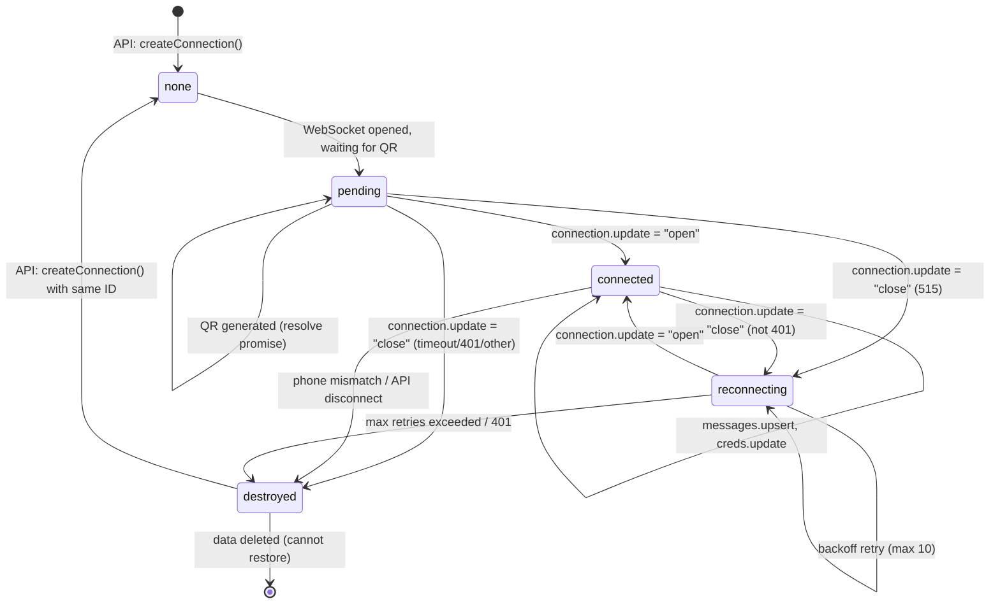
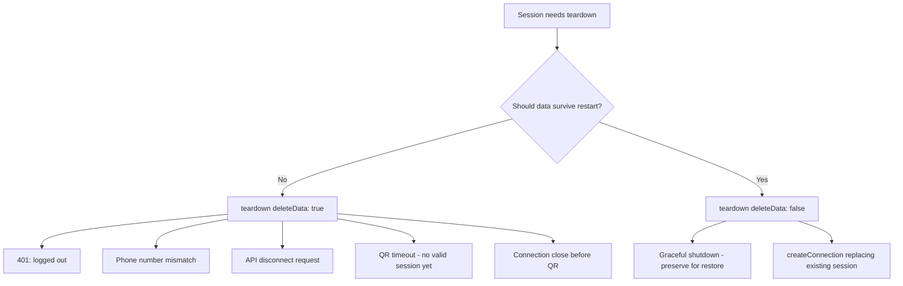
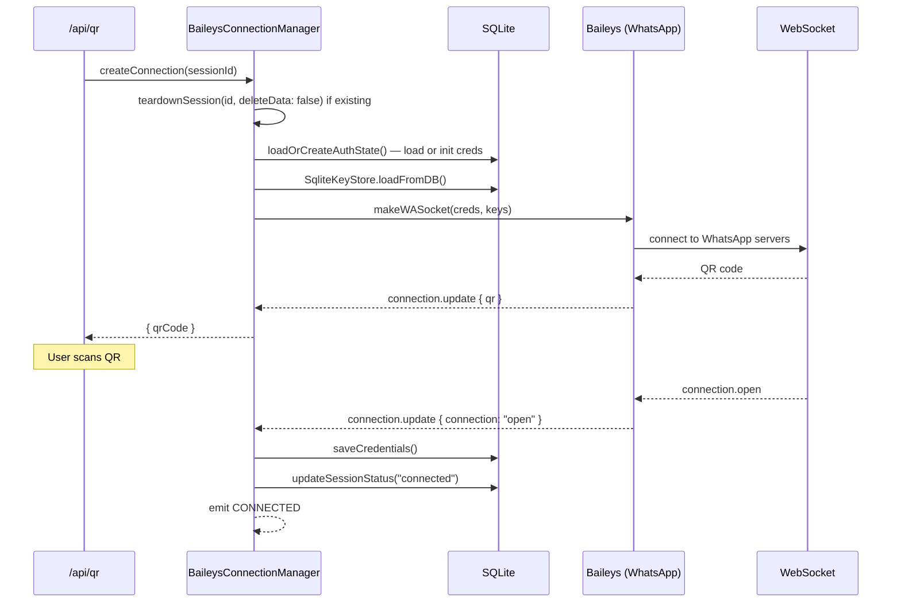
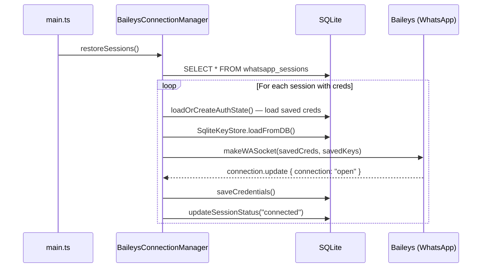
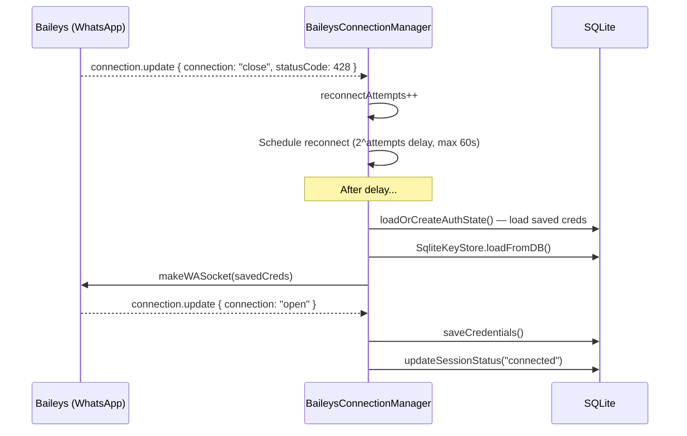
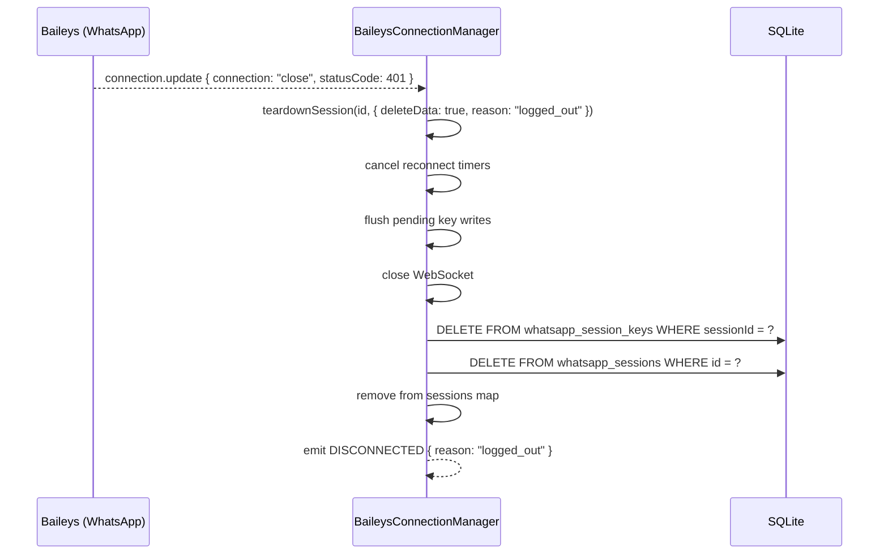
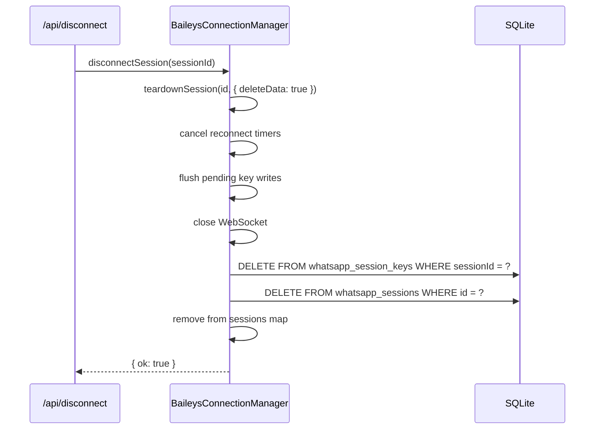
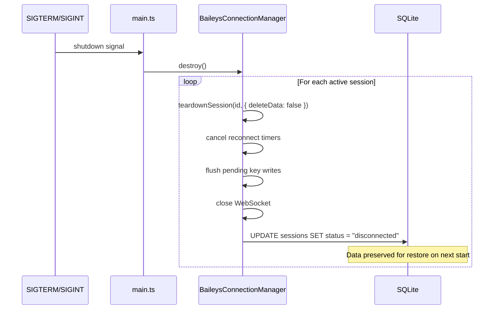

# WhatsApp Session Lifecycle

## State Machine

A session progresses through a finite set of states. Every transition has one entry point (`teardownSession`) for cleanup, which eliminates double-delete bugs and key store leaks.



### State Descriptions

| State | In-memory? | Data in DB? | Meaning |
|-------|-----------|-------------|---------|
| `none` | No | Maybe | No active session for this ID |
| `pending` | Yes | Yes (new creds) | WebSocket open, waiting for QR scan |
| `connected` | Yes | Yes (creds + status) | Authenticated, processing messages |
| `reconnecting` | Yes | Yes | Between close and open, backoff retry |
| `destroyed` | No | No (deleted) | Session nuked, cannot be restored |

### Key Insight

There are only two ways a session exits the machine:

1. **`teardownSession(id, { deleteData: true })`** — Nukes DB data. Used for: 401 logout, phone mismatch, API disconnect, QR timeout, connection closed before QR. The session cannot be restored.
2. **`teardownSession(id, { deleteData: false })`** — Preserves DB data. Used for: graceful shutdown, reconnection prep. The session can be restored on restart.

## Disconnection Decision Table

Every call site that tears down a session goes through `teardownSession`. Here's when each mode is used:



| Trigger | `deleteData` | Reason |
|---------|-------------|--------|
| API `/api/disconnect` | `true` | User explicitly requested disconnect |
| 401 logout | `true` | Phone explicitly logged out, creds are invalid |
| Phone mismatch | `true` | Wrong phone, must not restore |
| QR timeout (30s) | `true` | No valid session established yet |
| Connection close before QR | `true` | No valid session established yet |
| Graceful shutdown (`destroy()`) | `false` | Must survive container restart |
| `createConnection` replacing existing | `false` | Credentials may still be valid for reconnect |
| Reconnection scheduling (close event) | Neither | No teardown — just schedules reconnect |

## Sequence Diagrams

### Fresh Connection (QR Scan)



### Reconnection After Restart



### Connection Close + Reconnection



### 401 Logout (Permanent)



### API Disconnect



### Graceful Shutdown



## Key Store Flush Pipeline

Signal protocol keys are not written to DB immediately — they're batched and flushed every 2 seconds.

```
Baileys creds.update
    → SqliteKeyStore.set()
        → cache.set(key, value)
        → mutationQueue.push({ type, id, value, operation })

Every 2 seconds (or when queue > 1000):
    → flushMutations()
        → batch = mutationQueue.splice(0)
        → for each upsert: INSERT ... ON CONFLICT DO UPDATE
        → for each delete: DELETE WHERE ...
        → on error:
            → SQLITE_READONLY_DBMOVED: retry up to 3x, then discard queue
            → other errors: re-queue batch, retry next interval

On session teardown:
    → SqliteKeyStore.forceFlush()
    → SqliteKeyStore.destroy() — stops flush interval
```

## SQLITE_READONLY_DBMOVED Protection

The app sets `PRAGMA journal_mode=DELETE` at connection time to prevent WAL auto-checkpoint from changing the database file inode on macOS Docker bind mounts (osxfs).

As defense-in-depth, `SqliteKeyStore.flushMutations()` detects DBMOVED errors specifically:

1. On first occurrence: log error, attempt `PRAGMA journal_mode=DELETE` to recover the connection
2. Up to 3 retries: continue attempting flushes
3. After 3 consecutive failures: discard the mutation queue (prevents unbounded growth and unhandled rejection crash), log `fatal`
4. On successful flush: reset the consecutive error counter

This prevents the death spiral that crashed the process before: mutations piling up, each flush failing with DBMOVED, eventually causing an unhandled promise rejection.
