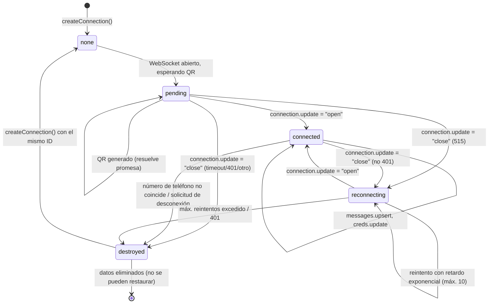
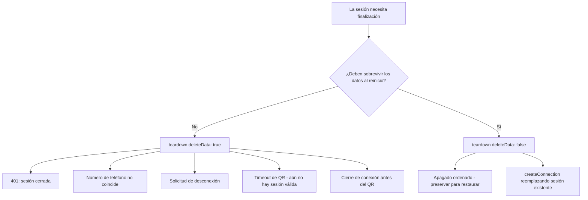
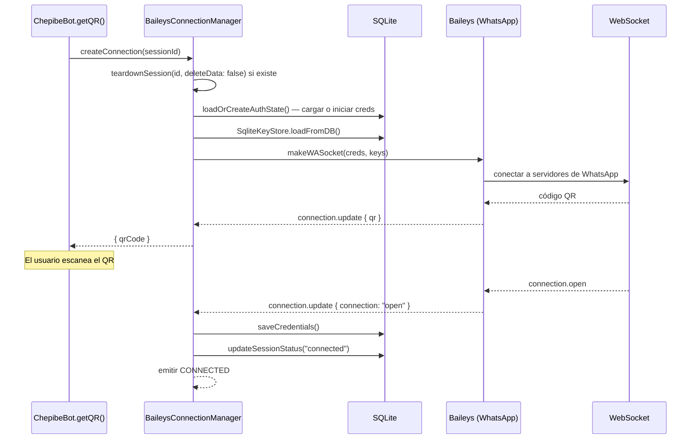
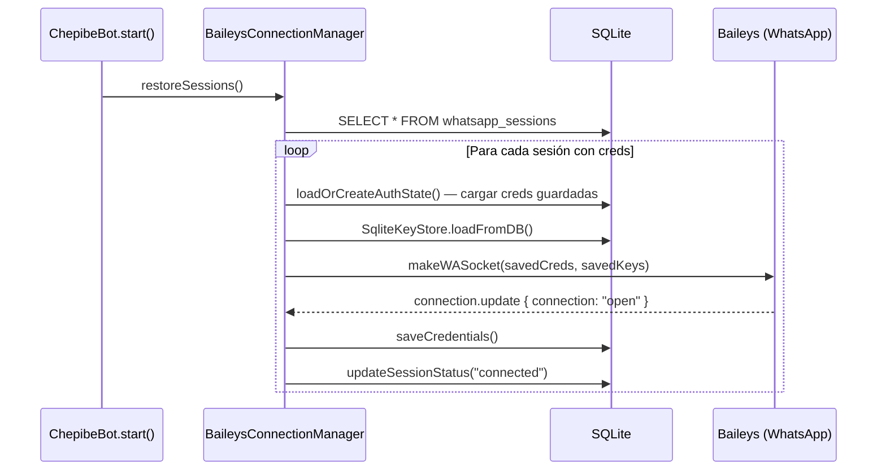
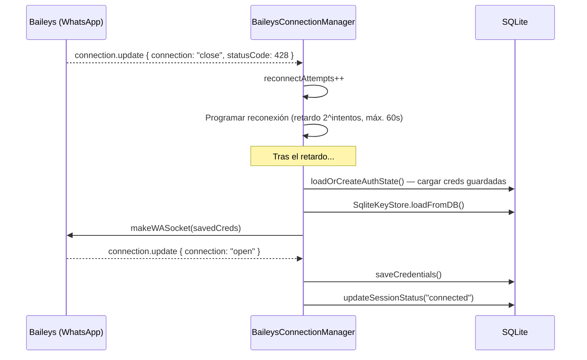
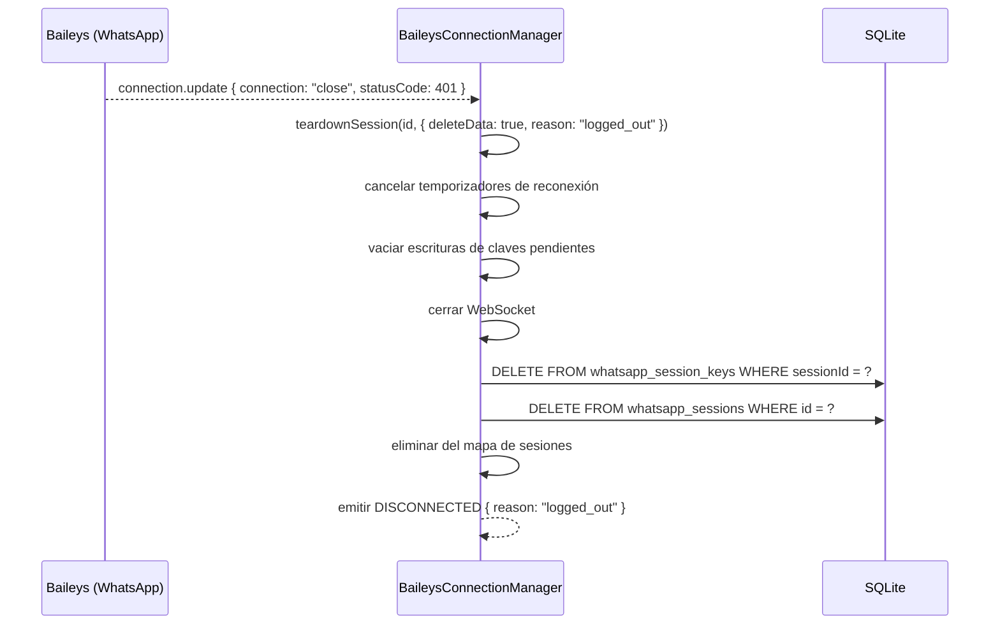
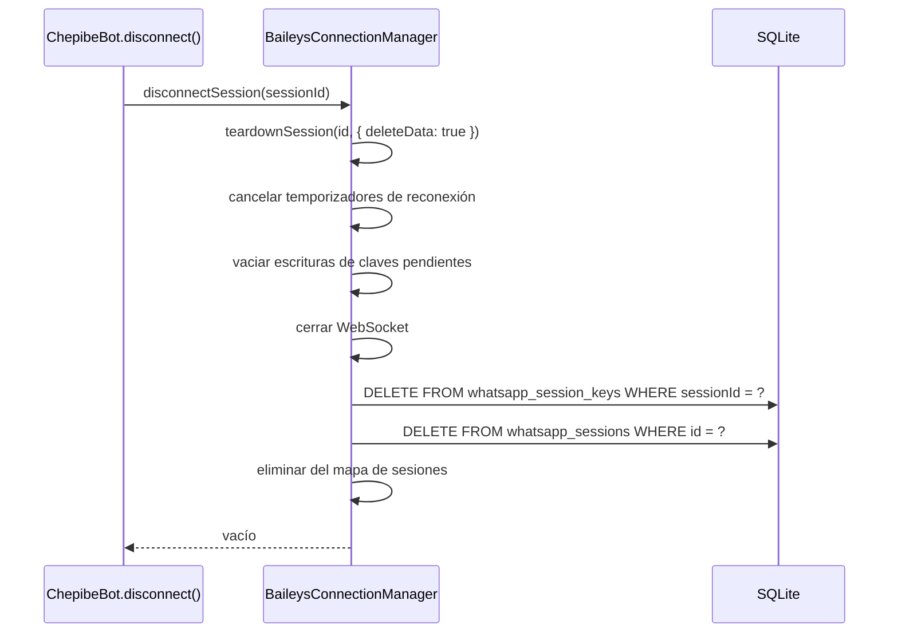
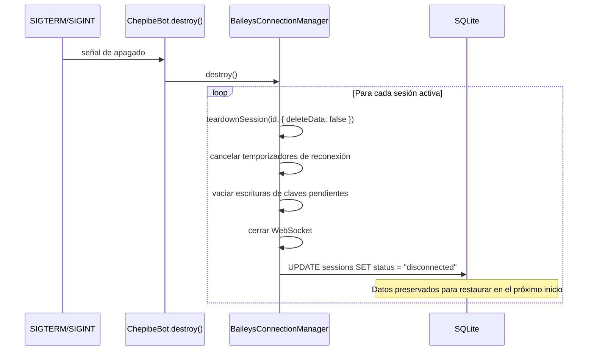
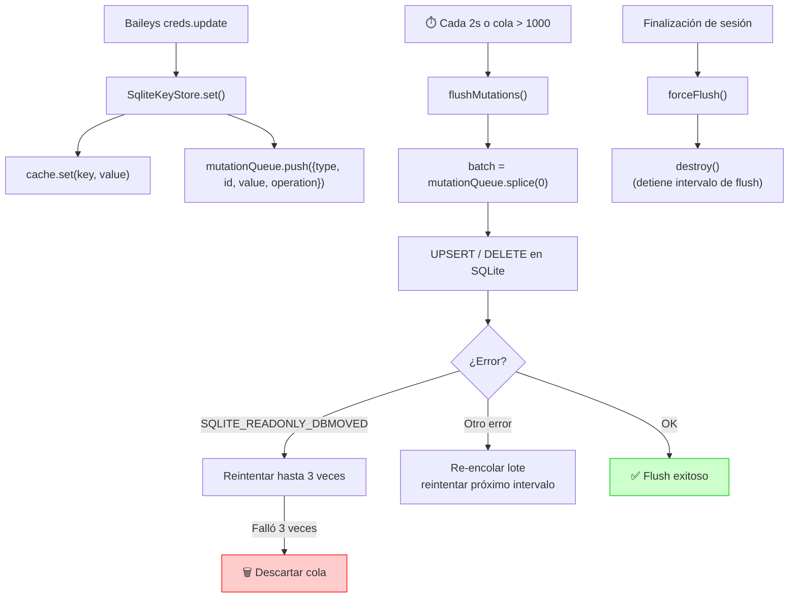

# Ciclo de Vida de la Sesión de WhatsApp

## Máquina de Estados

Una sesión transita por un conjunto finito de estados. Cada transición cuenta con un único punto de entrada (`teardownSession`) para la limpieza, lo que elimina errores de doble eliminación y fugas del almacén de claves.

### Descripción de los Estados

| Estado | ¿En memoria? | ¿Datos en DB? | Significado |
|--------|-------------|---------------|-------------|
| `none` | No | Quizás | No hay sesión activa para este ID |
| `pending` | Sí | Sí (creds nuevos) | WebSocket abierto, esperando escaneo de QR |
| `connected` | Sí | Sí (creds + estado) | Autenticado, procesando mensajes |
| `reconnecting` | Sí | Sí | Entre cierre y apertura, reintento con retardo exponencial |
| `destroyed` | No | No (eliminados) | Sesión destruida, no puede restaurarse |

### Observación Clave

Existen únicamente dos formas en que una sesión abandona la máquina:

1. **`teardownSession(id, { deleteData: true })`** — Elimina los datos de la base de datos. Utilizado para: cierre de sesión 401, número de teléfono no coincidente, solicitud de desconexión, timeout de QR, cierre de conexión antes del QR. La sesión no puede restaurarse.
2. **`teardownSession(id, { deleteData: false })`** — Preserva los datos de la base de datos. Utilizado para: apagado ordenado, preparación de reconexión. La sesión puede restaurarse al reiniciar.

## Tabla de Decisiones de Desconexión

Cada sitio de invocación que finaliza una sesión pasa por `teardownSession`. A continuación se detalla cuándo se utiliza cada modo:

| Disparador | `deleteData` | Motivo |
|---------|-------------|--------|
| Solicitud de desconexión | `true` | El usuario solicitó la desconexión explícitamente |
| Cierre de sesión 401 | `true` | El teléfono cerró sesión explícitamente, las credenciales son inválidas |
| Número de teléfono no coincide | `true` | Teléfono incorrecto, no debe restaurarse |
| Timeout de QR (60s) | `true` | Aún no se estableció una sesión válida |
| Cierre de conexión antes del QR | `true` | Aún no se estableció una sesión válida |
| Apagado ordenado (`destroy()`) | `false` | Debe sobrevivir al reinicio del contenedor |
| `createConnection` reemplazando existente | `false` | Las credenciales pueden seguir siendo válidas para reconectar |
| Programación de reconexión (evento close) | Ninguno | Sin teardown — solo programa la reconexión |

## Diagramas de Secuencia

### Conexión Nueva (Escaneo de QR)

### Reconexión Tras Reinicio

### Cierre de Conexión + Reconexión

### Cierre de Sesión 401 (Permanente)

### Solicitud de Desconexión

### Apagado Ordenado

## Canalización de Flush del Almacén de Claves

Las claves del protocolo Signal no se escriben en la base de datos inmediatamente: se agrupan en lotes y se persisten cada 2 segundos.

## Protección contra SQLITE_READONLY_DBMOVED

La aplicación establece `PRAGMA journal_mode=DELETE` al momento de la conexión para evitar que el auto-checkpoint de WAL modifique el inodo del archivo de la base de datos en montajes enlazados de Docker sobre macOS (osxfs).

Como medida de defensa en profundidad, `SqliteKeyStore.flushMutations()` detecta específicamente los errores DBMOVED:

1. En la primera ocurrencia: registra el error e intenta `PRAGMA journal_mode=DELETE` para recuperar la conexión
2. Hasta 3 reintentos: continúa intentando los flushes
3. Tras 3 fallas consecutivas: descarta la cola de mutaciones (evita el crecimiento ilimitado y el cierre por rechazo de promesa no manejado) y registra `fatal`
4. En un flush exitoso: reinicia el contador de errores consecutivos

Esto evita la espiral de fallos que anteriormente provocaba el cierre del proceso: las mutaciones se acumulaban, cada flush fallaba con DBMOVED y finalmente se producía un rechazo de promesa no manejado.
