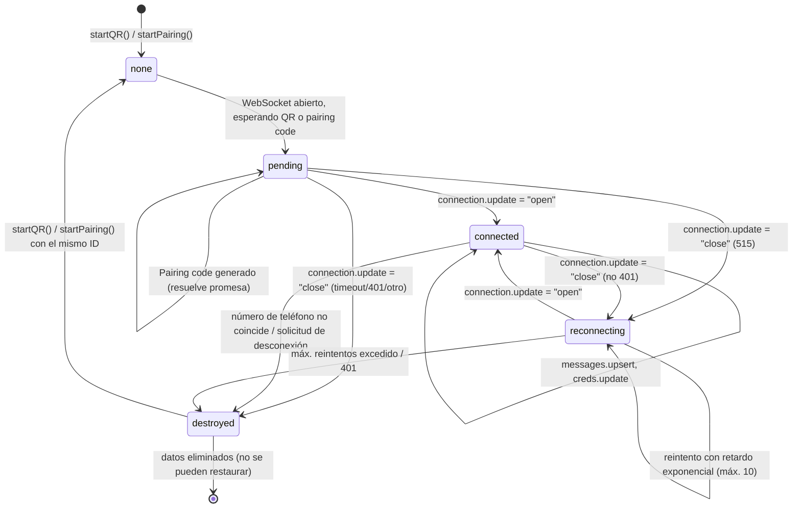
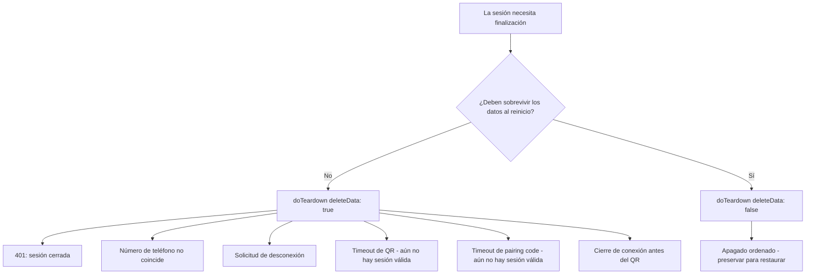
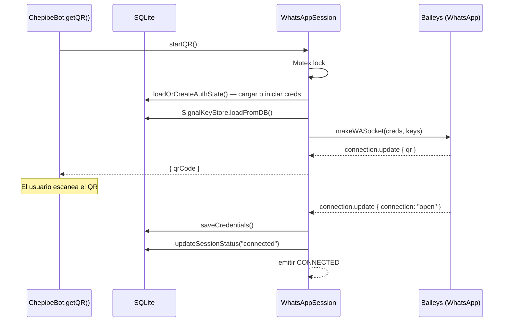
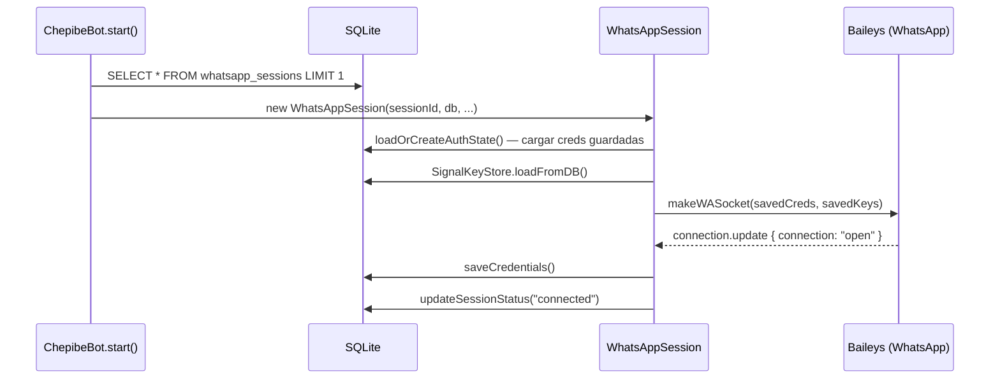
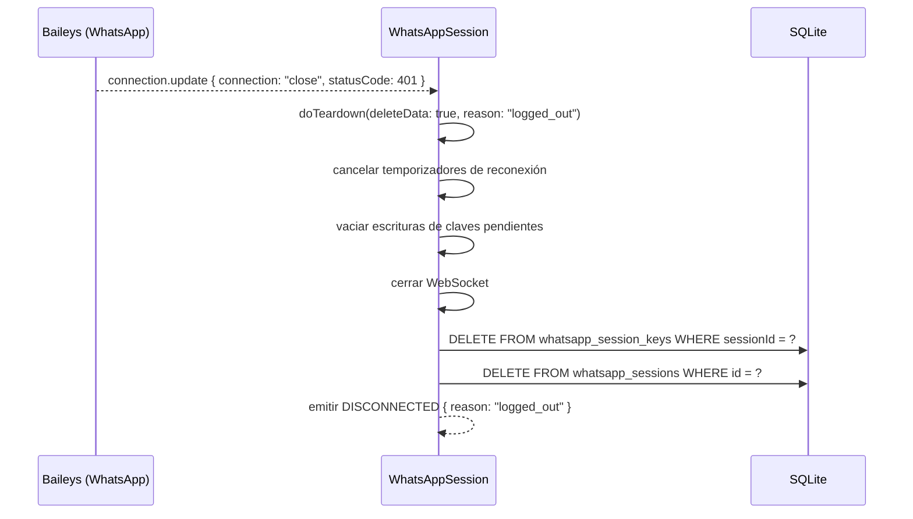
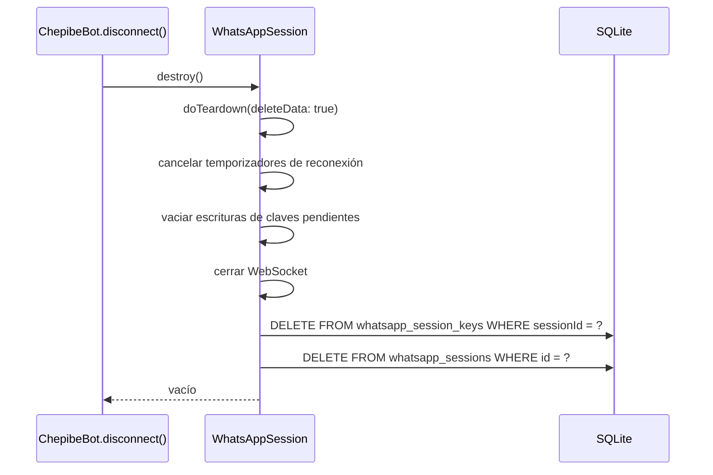
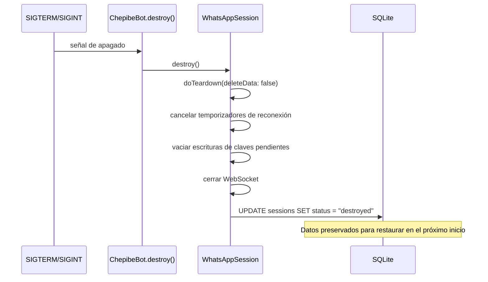

# Ciclo de Vida de la Sesión de WhatsApp

## Máquina de Estados

Una sesión transita por un conjunto finito de estados. Cada transición cuenta con un único punto de entrada (`doTeardown`) para la limpieza, lo que elimina errores de doble eliminación y fugas del almacén de claves.



### Descripción de los Estados

| Estado | ¿En memoria? | ¿Datos en DB? | Significado |
|--------|-------------|---------------|-------------|
| `none` | No | Quizás | No hay sesión activa para este ID |
| `pending` | Sí | Sí (creds nuevos) | WebSocket abierto, esperando escaneo de QR o ingreso de pairing code |
| `connected` | Sí | Sí (creds + estado) | Autenticado, procesando mensajes |
| `reconnecting` | Sí | Sí | Entre cierre y apertura, reintento con retardo exponencial |
| `destroyed` | No | No (eliminados) | Sesión destruida, no puede restaurarse |

### Observación Clave

Existen únicamente dos formas en que una sesión abandona la máquina:

1. **`doTeardown(deleteData: true)`** — Elimina los datos de la base de datos. Utilizado para: cierre de sesión 401, número de teléfono no coincidente, solicitud de desconexión, timeout de QR, timeout de pairing code, cierre de conexión antes del QR. La sesión no puede restaurarse.
2. **`doTeardown(deleteData: false)`** — Preserva los datos de la base de datos. Utilizado para: apagado ordenado. La sesión puede restaurarse al reiniciar.

## Tabla de Decisiones de Desconexión

Cada sitio de invocación que finaliza una sesión pasa por `doTeardown`. A continuación se detalla cuándo se utiliza cada modo:



| Disparador | `deleteData` | Motivo |
|---------|-------------|--------|
| Solicitud de desconexión | `true` | El usuario solicitó la desconexión explícitamente |
| Cierre de sesión 401 | `true` | El teléfono cerró sesión explícitamente, las credenciales son inválidas |
| Número de teléfono no coincide | `true` | Teléfono incorrecto, no debe restaurarse |
| Timeout de QR (60s) | `true` | Aún no se estableció una sesión válida |
| Timeout de pairing code (60s) | `true` | Aún no se estableció una sesión válida |
| Cierre de conexión antes del QR | `true` | Aún no se estableció una sesión válida |
| Apagado ordenado (`destroy()`) | `false` | Debe sobrevivir al reinicio del contenedor |
| `startQR`/`startPairing` reemplazando existente | `true` | Reemplazar la sesión limpia, datos frescos |
| Programación de reconexión (evento close) | Ninguno | Sin teardown — solo programa la reconexión |

## Diagramas de Secuencia

### Conexión Nueva (Escaneo de QR)



### Conexión Nueva con Código de Emparejamiento (Pairing Code)

Alternativa al QR: el usuario solicita un código de 8 dígitos ingresando su número de teléfono, y lo ingresa manualmente en WhatsApp.

```mermaid
sequenceDiagram
    participant W as Web UI (/qr)
    participant SVR as +page.server.ts
    participant BOT as ChepibeBot.requestPairingCode()
    participant WS as WhatsAppSession
    participant DB as SQLite
    participant BA as Baileys (WhatsApp)

    W->>SVR: POST form (action default)
    SVR->>SVR: Lee ALLOWED_PHONE de env
    SVR->>BOT: requestPairingCode(phoneNumber)
    BOT->>WS: startPairing(phoneNumber)
    WS->>WS: Mutex lock
    WS->>DB: loadOrCreateAuthState() — cargar o iniciar creds
    WS->>DB: SignalKeyStore.loadFromDB()
    WS->>BA: makeWASocket(creds, keys)
    BA-->>WS: connection.update { qr }
    WS->>BA: socket.requestPairingCode(phoneNumber)
    BA-->>WS: código de 8 dígitos
    WS-->>BOT: { code }
    BOT-->>SVR: { code }
    SVR-->>W: Muestra código de 8 dígitos
    Note over W: El usuario ingresa el código en
    WhatsApp → Dispositivos Vinculados →
    Vincular un dispositivo
    BA-->>WS: connection.update { connection: "open" }
    WS->>DB: saveCredentials()
    WS->>DB: updateSessionStatus("connected")
    WS-->>WS: emitir CONNECTED
```

**Duración del timeout:** 60 segundos. Si el código no se ingresa en ese tiempo, la sesión se destruye (`doTeardown(deleteData: true, reason: 'pairing_timeout')`).

**Número de teléfono:** Se toma de la variable de entorno `ALLOWED_PHONE` (formato internacional sin el signo `+`, ej. `5491171234567`).

### Reconexión Tras Reinicio



### Cierre de Conexión + Reconexión


### Cierre de Sesión 401 (Permanente)



### Solicitud de Desconexión



### Apagado Ordenado


